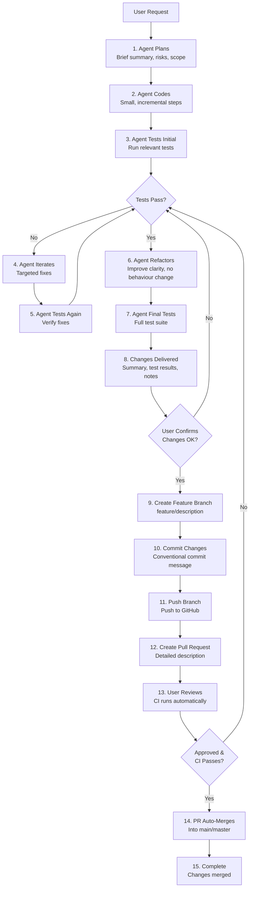

# Agent Workflow & Behaviour Guidelines

This document defines the expected workflow and behaviour for AI agents working on this React quiz & case-study engine codebase.

## Core Workflow: Plan → Code → Test → Iterate → Test → Refactor → Test

Agents must follow this rigorous workflow for all non-trivial changes:

### 1. Planning Phase

**Always start with a plan** before implementing changes:

- **Brief summary**: Provide a concise summary of goals, affected files, and approach
- **Risk assessment**: Identify potential risks, edge cases, and breaking changes
- **Scope definition**: Clearly define what will and won't be changed
- **Dependencies**: Note any dependencies on other files or features

**Example plan structure:**
```
Goal: Add validation for drag-and-drop questions
Affected files:
  - src/utils/questionHelpers.js (add validation logic)
  - src/components/questions/DragAndDrop.jsx (update UI feedback)
Risks: None - isolated change
Approach: Extend isQuestionFullyAnswered to handle drag-and-drop edge cases
```

### 2. Implementation Phase

**Implement changes in small, reviewable steps:**

- **Incremental changes**: Make changes in logical, testable increments
- **One concern at a time**: Focus on a single concern per implementation step
- **Keep changes scoped**: Avoid making unrelated changes in the same step
- **Commit-ready code**: Each step should produce working, commit-ready code

### 3. Initial Testing Phase

**After each implementation step, run appropriate tests:**

- **Unit tests**: Run tests for modified utility functions and helpers
- **Component tests**: Test component behaviour for UI changes
- **Integration tests**: For changes affecting multiple components, run integration tests
- **Manual verification**: For UI changes, verify behaviour in the browser when possible
- **Test outcomes**: Summarise test results clearly (passed/failed, coverage changes)

### 4. Iteration Phase

**Iterate on code based on test outcomes and discovered issues:**

- **Fix failures first**: Address test failures before proceeding
- **Targeted fixes**: Make minimal, targeted fixes rather than broad changes
- **Re-test after fixes**: Run tests again after each fix
- **Document issues**: Note any unexpected issues or edge cases discovered

### 5. Re-testing Phase

**After iterations, test again:**

- **Verify fixes**: Ensure all fixes work as expected
- **Regression testing**: Verify that changes don't break existing functionality
- **Edge case testing**: Test edge cases and boundary conditions

### 6. Refactoring Phase

**When logic stabilises, refactor for clarity:**

- **Improve naming**: Use descriptive, consistent names
- **Remove duplication**: Extract common patterns into utilities or components
- **Simplify logic**: Simplify complex conditionals and calculations
- **Improve structure**: Reorganise code for better readability
- **No behaviour changes**: Refactoring must not change functionality

### 7. Final Testing Phase

**After refactoring, run final tests:**

- **Full test suite**: Run all relevant tests to ensure nothing broke
- **Verify functionality**: Confirm that all features still work as expected
- **Performance check**: Verify that performance hasn't degraded

### 8. Delivery Phase

**Present final result with clear documentation and create PR:**

- **Change summary**: Clearly state what was changed and why
- **Test results**: Report which tests passed and any coverage improvements
- **Usage notes**: If applicable, note any changes to APIs or component interfaces
- **Trade-offs**: Explicitly mention any trade-offs or limitations

**After user confirms changes are acceptable, create PR:**

1. **Create feature branch**: Create a dedicated branch from main/master using naming convention:
   - `feature/short-description` for new features
   - `fix/issue-description` for bug fixes
   - `hotfix/critical-issue` for urgent fixes
   - `refactor/component-name` for refactoring
   - `chore/task-description` for maintenance tasks

2. **Commit changes**: Commit with descriptive conventional commit message:
   - `feat: add validation for unanswered bookmarks`
   - `fix: resolve timer interval cleanup issue`
   - `refactor: extract bookmark logic to helper function`
   - `test: add tests for drag-and-drop validation`

3. **Push branch**: Push the feature branch to GitHub

4. **Create Pull Request**: Create PR targeting main/master with detailed description including:
   - Summary of changes (what and why)
   - Affected files (list key files changed)
   - Test results (which tests pass, coverage changes)
   - Screenshots (if UI changes)
   - Breaking changes (if any)
   - CI status (mention if CI checks are required)

5. **Provide PR link**: Include the PR link in the delivery summary

6. **Wait for approval**: User reviews and approves (CI runs automatically)

7. **Confirm merge**: After PR is merged (auto-merge if CI passes and approved), confirm completion

## Communication Standards

### Language & Tone

- **British English**: Use British English spelling and terminology (e.g., "colour", "optimise", "behaviour")
- **Concise**: Be clear and concise, avoiding unnecessary verbosity
- **Technical accuracy**: Use precise technical terminology appropriate to the codebase

### Code Explanations

- **Design choices**: Briefly explain significant design decisions
- **Trade-offs**: Explicitly mention trade-offs when making decisions
- **Alternatives considered**: If relevant, mention alternative approaches considered
- **Future improvements**: Note any known limitations or areas for future improvement

### Error Handling

- **Clear error messages**: Provide clear, actionable error messages
- **Graceful degradation**: Handle errors gracefully without breaking the application
- **User-friendly feedback**: Ensure error messages are user-friendly, not technical jargon

## Testing Expectations

### Test Coverage

- **Critical paths**: Ensure high test coverage for critical functionality (quiz flow, answer validation, timer)
- **Utilities**: Pure utility functions should have comprehensive test coverage
- **New features**: Include tests for all new features and significant changes

### Test Types

- **Unit tests**: For pure functions and isolated logic
- **Component tests**: For React components and user interactions
- **Integration tests**: For multi-component flows and context interactions

### Test Quality

- **Readable tests**: Tests should be clear and self-documenting
- **Maintainable tests**: Tests should be easy to update when code changes
- **Fast tests**: Prefer fast, isolated tests over slow, complex tests

## Code Quality Standards

### Before Delivering Changes

- [ ] All tests pass
- [ ] Code follows project coding standards (see `.cursor/rules/coding-and-style.mdc`)
- [ ] Security guidelines are followed (see `.cursor/rules/security-and-privacy.mdc`)
- [ ] Performance considerations are addressed (see `.cursor/rules/performance-and-storage.mdc`)
- [ ] Architecture guidelines are followed (see `.cursor/rules/architecture.mdc`)
- [ ] Changes are properly documented
- [ ] No console errors or warnings in development
- [ ] Code is properly formatted and linted

## Version Control & PR Workflow

### Branch Strategy (Best Practice: Feature Branches Per Change)

**Always create a dedicated branch per change** - this is industry best practice for PR-based workflows:

- **Isolation**: Work doesn't break main while mid-change
- **Reviewable diffs**: PRs stay focused and easier to approve
- **CI protection**: Tests/lint run before merge, keeping main deployable
- **Clean rollback**: Reverting a single PR/merge is straightforward
- **Parallel work**: Multiple changes can be developed safely without conflicts

**Never commit directly to main** for non-trivial changes. Direct commits to main are only acceptable for solo projects with trivial, low-risk changes where main isn't protected. For production/team setups, always use feature branches + PRs.

### Branch Naming Conventions

Use descriptive branch names following these patterns:

- `feature/short-description` (e.g., `feature/add-bookmark-validation`)
- `fix/issue-description` or `bugfix/issue-description` (e.g., `fix/timer-memory-leak`)
- `hotfix/critical-issue` (e.g., `hotfix/security-patch`)
- `refactor/component-name` (e.g., `refactor/quiz-context-optimisation`)
- `chore/task-description` (e.g., `chore/update-dependencies`)

### Branch Lifecycle

- **Short-lived branches**: Aim for hours to a couple of days, not weeks
- **Small PRs**: Keep changes focused and reviewable (easier reviews, fewer merge conflicts)
- **One branch per change**: Each feature/bugfix gets its own branch

### Commit Message Format

Use conventional commits style for consistency:

- `feat: add validation for unanswered bookmarks`
- `fix: resolve timer interval cleanup issue`
- `refactor: extract bookmark logic to helper function`
- `test: add tests for drag-and-drop validation`
- `chore: update dependencies`
- `docs: update AGENTS.md workflow`

### PR Requirements

**Title**: Clear, descriptive title matching commit message style

**Description template** (include all relevant sections):

- **Summary of changes**: What was changed and why
- **Affected files**: List key files changed
- **Test results**: Which tests pass, coverage changes
- **Screenshots**: If UI changes (attach screenshots)
- **Breaking changes**: If any (clearly document)
- **CI status**: Mention if CI checks are required

### PR Best Practices

- **Small, focused PRs**: Easier to review and approve
- **CI protection**: Ensure tests/lint pass before merge
- **Squash merge preferred**: Keeps history clean (or rebase merge for linear history)
- **Protected main**: Require PRs + passing checks + approval (configure in GitHub settings)
- **Auto-merge**: Enable auto-merge if CI passes and user approves

### When to Create PRs

- **After user confirmation**: Only create PR after user confirms changes are acceptable
- **Before final delivery**: PR creation is part of the delivery process
- **For all non-trivial changes**: Use PR workflow for any change that affects functionality, not just large features

**Note**: If main branch is protected (recommended), the PR must pass CI checks and receive approval before merging.

## Workflow Visualisation



## Special Considerations for This Codebase

### Quiz & Case Study Features

- **State management**: Be careful when modifying context reducers - ensure state transitions are correct
- **Timer logic**: Timer intervals must be properly managed to avoid memory leaks
- **Question types**: When modifying question types, ensure all question types still work correctly
- **Navigation**: Test navigation flows thoroughly, especially review modes

### JSON Data

- **Data format**: Respect the existing JSON structure for questions and case studies
- **Validation**: Ensure data validation handles edge cases in JSON files
- **Loading**: Maintain lazy loading patterns for JSON data

### User Experience

- **Accessibility**: Maintain accessibility features (ARIA labels, keyboard navigation)
- **Responsive design**: Ensure changes work across different screen sizes
- **Performance**: Maintain fast load times and smooth interactions

## Example Workflow

**Request**: "Add validation to prevent submitting quiz with unanswered bookmarked questions"

1. **Plan**: 
   - Goal: Add validation before quiz submission
   - Affected: `src/components/Quiz/Quiz.jsx` (submission handler)
   - Risk: Low - isolated change
   - Approach: Check for unanswered bookmarks before allowing submission

2. **Code**: 
   - Modify submission handler to check for unanswered bookmarked questions
   - Add warning modal if unanswered bookmarks exist

3. **Test**: 
   - Test submission with unanswered bookmarks (should show warning)
   - Test submission without unanswered bookmarks (should proceed)
   - Test submission with all bookmarks answered (should proceed)

4. **Iterate**: 
   - Fix edge case where bookmark is removed but question still unanswered
   - Re-test

5. **Refactor**: 
   - Extract bookmark checking logic to helper function
   - Improve variable names
   - Re-test

6. **Deliver**: 
   - Summary: Added validation to prevent submission with unanswered bookmarked questions
   - Tests: All tests pass, added 3 new test cases
   - Notes: Users can still submit after reviewing bookmarked questions

7. **User Confirms**: Changes are acceptable

8. **Create Feature Branch**:
   ```bash
   git checkout -b feature/add-bookmark-submission-validation
   ```

9. **Commit Changes**:
   ```bash
   git commit -m "feat: add validation to prevent submission with unanswered bookmarks"
   ```

10. **Push Branch**:
    ```bash
    git push origin feature/add-bookmark-submission-validation
    ```

11. **Create Pull Request**:
    - **Title**: `feat: add validation to prevent submission with unanswered bookmarks`
    - **Description**:
      ```
      ## Summary
      Added validation to prevent quiz submission when there are unanswered bookmarked questions.
      
      ## Changes
      - Modified `src/components/Quiz/Quiz.jsx` to check for unanswered bookmarks before submission
      - Added warning modal to alert users about unanswered bookmarked questions
      - Extracted bookmark checking logic to helper function for reusability
      
      ## Affected Files
      - `src/components/Quiz/Quiz.jsx`
      - `src/utils/questionHelpers.js` (helper function)
      
      ## Test Results
      - All existing tests pass
      - Added 3 new test cases for bookmark validation scenarios
      - Test coverage increased by 2%
      
      ## Notes
      Users can still submit after reviewing and answering bookmarked questions.
      ```
    - **CI Status**: All checks pass (tests, lint)

12. **User Reviews & Approves**: PR is reviewed and approved

13. **PR Auto-Merges**: After approval and CI pass, PR is automatically merged into main

14. **Complete**: Changes are now in main branch, PR link provided for reference

## Questions & Clarifications

If requirements are ambiguous or the scope is unclear:

- **Ask early**: Ask clarifying questions before starting implementation
- **Be specific**: Ask specific questions about expected behaviour or edge cases
- **Propose solutions**: When asking, propose potential solutions for discussion

---

**Remember**: Quality over speed. It's better to take time to implement correctly with proper testing than to rush and introduce bugs.
